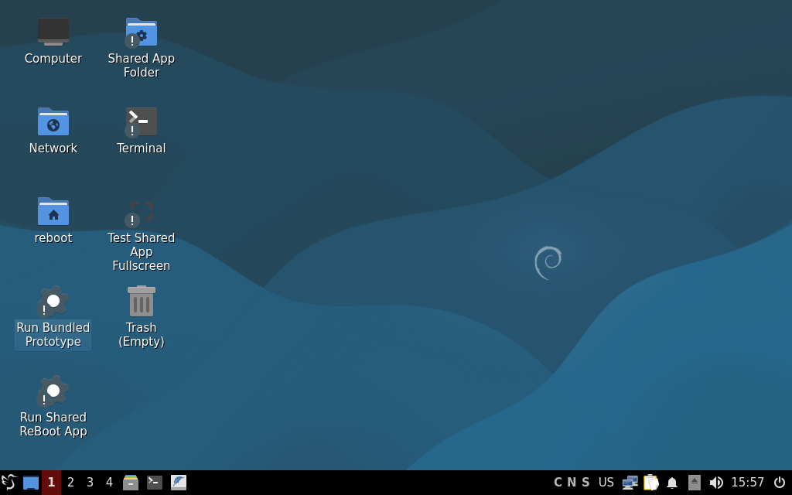
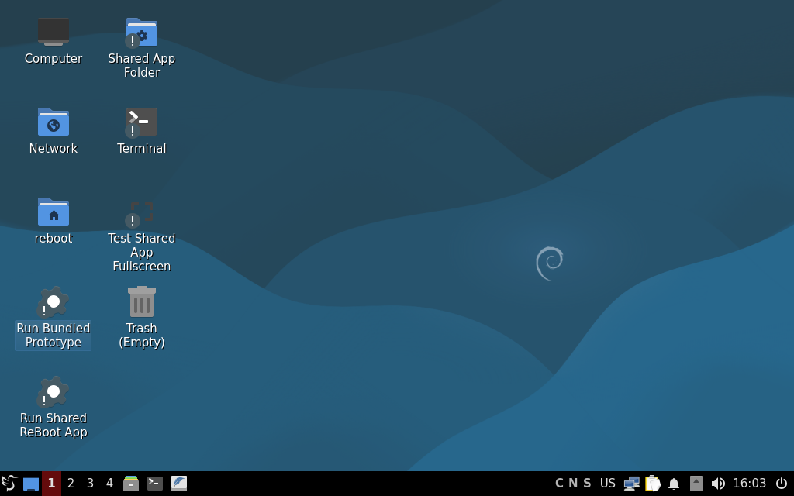
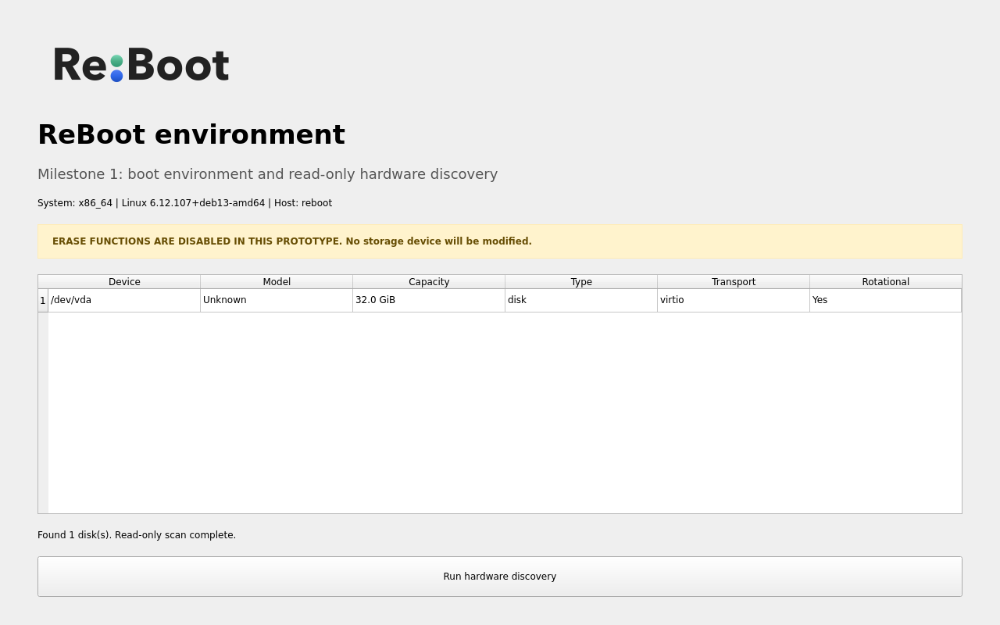

# ReBoot boot environment development

This file is the authoritative implementation record for the ReBoot boot
environment. Update it whenever the architecture, build process, dependencies,
test results, or operational workflow changes.

## 1. Goal

Build a lightweight, bootable environment that:

1. Boots from USB on common school laptops and desktops.
2. Automatically opens the ReBoot Python application.
3. Provides the storage and hardware tools required by the ReBoot workflow.
4. Can be tested safely in a virtual machine.
5. Stores certificates, lifecycle logs, and diagnostics persistently.
6. Does not expose destructive erase operations until the erase backend and
   safety controls have been implemented and tested.

The first milestone is a launch platform, not the completed secure-erasure
product.

## 2. Decisions

| Decision | Choice | Reason |
|---|---|---|
| Initial hardware | amd64 Intel/AMD PCs | Covers the majority of conventional school PCs and supports standard Debian Live images |
| Distribution | Debian 13 "trixie" | Stable, well-supported, open source, and directly supported by `live-build` |
| Image format | Hybrid ISO | Boots in a VM and can be written directly to USB |
| Desktop | LXQt on Xorg | Lightweight but provides a panel, menu, terminal, file manager, and display settings |
| Display manager | LightDM | Supports automatic login into the ReBoot session |
| Application toolkit | Python 3 + PySide6 | Matches the existing product requirements |
| Persistent data | Debian Live persistence for `/var/lib/reboot` | Keeps reports and logs separate from the read-only operating system |
| Application | Current repository source, launched manually | Keeps the image and application versioned together while preserving a development workbench |

Apple Silicon is not part of the first image. It requires an Asahi-specific
installation path. Intel Macs with a T2 chip may require a separate kernel and
driver profile and are not claimed as supported by this first image.

## 3. Architecture

```text
Hybrid Debian Live ISO
|
+-- Debian 13 amd64 runtime
|   +-- Linux kernel and firmware
|   +-- Xorg, LightDM, LXQt
|   +-- NetworkManager
|
+-- ReBoot application
|   +-- PySide6 runtime
|   +-- read-only hardware discovery
|   +-- persistent application log
|   +-- manual windowed and fullscreen launchers
|   +-- QEMU host-shared application workspace
|
+-- Storage tooling
|   +-- lsblk / wipefs
|   +-- hdparm
|   +-- nvme-cli
|   +-- smartmontools
|   +-- parted / gdisk
|   +-- dmidecode / lshw / pciutils / usbutils
|
+-- Persistence
    +-- optional partition labelled "persistence"
    +-- persistence.conf exposes /var/lib/reboot
```

No application launches automatically in the development image. The future
production image may use kiosk startup after the application is ready.

The future erase engine must be separated from the unprivileged UI. The UI
must not run entirely as root. A narrowly scoped privileged service with
explicit device validation and authorization should perform destructive
operations.

## 4. Project layout

```text
boot-environment/
|-- auto/
|   |-- build
|   `-- config
|-- config/
|   |-- includes.chroot/
|   |-- hooks/normal/
|   `-- package-lists/
|-- scripts/
|   |-- build-debian.sh
|   |-- configure-persistence-linux.sh
|   |-- flash-usb-macos.sh
|   `-- test-qemu.sh
|-- Makefile
`-- README.md
```

Files under `config/includes.chroot/` are copied into the live operating
system. Before each build, `scripts/build-debian.sh` stages the current
repository `app/` tree as `/opt/reboot/app` and installs the project licensing
documents under `/usr/share/doc/reboot`.

## 5. Build prerequisites

`live-build` is Linux-native. The image must be built on Debian 13 or in a
Debian 13 VM/container:

```bash
sudo apt update
sudo apt install live-build
```

This development Mac is Apple Silicon (`arm64`). QEMU is installed, including
`qemu-system-x86_64`, but Docker/Podman is not currently installed. An amd64
Debian build VM is therefore used to produce the first ISO. QEMU can also test
the resulting amd64 ISO on this Mac using software emulation.

## 6. Build procedure

From an amd64 Debian 13 environment:

```bash
cd boot-environment
./scripts/build-debian.sh
```

The script:

1. Refuses to run outside Linux.
2. Checks for `lb`.
3. Stages the current ReBoot application and licensing documents.
4. runs `lb config`;
5. runs `lb build`;
6. collects corresponding Debian source packages;
7. creates SHA-256 checksums for the ISO and source archive.

Expected output:

```text
live-image-amd64.hybrid.iso
live-image-amd64.hybrid.iso.sha256
live-image-amd64-source.debian.tar
live-image-amd64-source.live.tar
live-image-amd64.sources.sha256
```

On the current Apple Silicon Mac, the automated build wrapper downloads and
verifies the official Debian 13 amd64 generic cloud image, creates a 40 GiB
sparse overlay under `~/.cache/reboot-builder`, starts an emulated build VM,
copies only the image source and logo into it, runs the same Debian build
script, and copies the ISO back:

```bash
cd boot-environment
./scripts/build-via-qemu-macos.sh
```

The 40 GiB overlay is sparse and does not initially consume 40 GiB of physical
storage. The VM cache is deliberately outside the repository. The resulting ISO and
checksum are written to `boot-environment/`.

To rebuild from a clean `live-build` state:

```bash
./scripts/build-debian.sh --clean
```

This removes only generated `live-build` working data inside
`boot-environment`, not project source files.

## 7. VM testing

On the current Mac:

```bash
cd boot-environment
./scripts/create-test-disk.sh
./scripts/test-qemu.sh
```

UEFI mode:

```bash
./scripts/test-qemu.sh --uefi
```

The VM uses x86_64 software emulation because the host is ARM64. It is expected
to be slower than physical hardware. The initial VM test must confirm:

- the ISO reaches the graphical session;
- the `reboot` live user logs in automatically;
- LXQt shows a panel, menu, file manager, terminal, and desktop launchers;
- the desktop is usable at the 1024x640 QEMU baseline;
- no ReBoot application starts automatically;
- the Mac `app/` directory is visible at `/mnt/reboot-app`;
- the bundled current application can be launched manually in a window;
- closing and reopening the application does not trigger any erase command.

QEMU forwards guest SSH port 22 to `127.0.0.1:2222`. The image does not install
an insecure default password. Configure a password or authorized key from the
local VM console before using SSH.

### Shared application development

The local, non-cloud-synced host directory:

```text
~/Developer/ReBoot/app/
```

is exposed to the VM using Virtio 9p and mounted at:

```text
/mnt/reboot-app
```

The recovered application uses `~/Developer/ReBoot/app/main.py` as its entry
point. Set `REBOOT_APP_DIR` when running `scripts/test-qemu.sh` to test another
checkout. Desktop launchers support windowed and fullscreen testing. Changes
made on the Mac are visible in the VM without rebuilding the ISO.

## 8. USB flashing

The macOS flashing helper is intentionally interactive and requires an exact
whole-disk identifier:

```bash
diskutil list external
cd boot-environment
./scripts/flash-usb-macos.sh live-image-amd64.hybrid.iso /dev/diskN
```

Writing an image destroys the existing contents of the selected USB device.
The helper refuses mounted volume paths, requires `/dev/diskN`, prints the disk
information, and requires the disk identifier to be typed again.

Never use an internal disk identifier.

## 9. Persistent ReBoot data

The live ISO is read-only. Persistent certificates and lifecycle logs use a
separate ext4 partition labelled `persistence`, containing:

```text
/var/lib/reboot
```

Prepare an already-created Linux partition from a Linux environment:

```bash
sudo ./scripts/configure-persistence-linux.sh /dev/sdXN
```

The helper formats only the explicitly supplied partition after confirmation.
Do not pass a whole disk. Creating or resizing the partition itself is kept
separate because partition layout handling differs between USB devices and is
too destructive to automate in the first milestone.

Runtime data locations:

```text
/var/lib/reboot/certificates/
/var/lib/reboot/logs/
/var/lib/reboot/lifecycle/
```

Without a persistence partition, these directories work for the current live
session but disappear at shutdown.

## 10. Security boundary

The current application performs read-only hardware analysis. It does not
invoke `wipefs`, `hdparm`, `nvme`, `parted`, `gdisk`, `dd`, or any other
destructive command. Those tools are present for later backend development,
but the generated PDF explicitly states that erasure was not performed.

Before implementing erase operations:

1. Define a supported-device matrix.
2. Exclude the boot USB and mounted system media.
3. Require an explicit device identity and confirmation flow.
4. Implement a privileged backend separate from the UI.
5. Record command, device identifiers, method, timestamps, return codes, and
   verification evidence.
6. Test each method on disposable drives and VM disks.
7. Map erase methods to current recognized sanitization guidance; do not claim
   GDPR compliance solely because a command completed.

## 11. Status log

### 2026-09-01 - Initial architecture

- Reviewed the PRD, research paper, presentation, and design notes.
- Selected Debian 13 Live, amd64, Openbox, LightDM, Python 3, and PySide6.
- Selected a hybrid ISO for both VM and USB use.
- Scoped persistence to `/var/lib/reboot`.
- Kept Apple Silicon and T2-specific support outside milestone one.
- Began a non-destructive hardware-discovery application.
- Added reproducible `live-build` configuration, runtime package list,
  automatic graphical login, kiosk launcher, VM helpers, guarded USB flashing,
  and persistence setup tooling.
- Confirmed shell-script and Python syntax on the development Mac.
- Added an automated amd64 Debian QEMU builder for the Apple Silicon
  development Mac; its base image is verified against Debian's SHA-512 list.
- Built `live-image-amd64.hybrid.iso` successfully in the QEMU builder.
- Build duration under amd64 software emulation was approximately 38 minutes.
- Resulting ISO size is approximately 1.2 GiB.
- ISO SHA-256:
  `a6f33a19ede5f70831518e5f83ad8cdce33abf7fb2ed93b575a7280e80dc6073`.
- Confirmed the ISO contains a bootable DOS/MBR hybrid boot sector and the
  volume label `REBOOT_LIVE`.
- Booted the ISO through QEMU in legacy BIOS mode.
- Booted the ISO through QEMU in UEFI mode using EDK II firmware.
- In both modes, LightDM automatically logged in, Openbox started, the PySide6
  UI opened full-screen, and read-only discovery found the disposable
  `/dev/vda` 32 GiB VirtIO disk.
- No erase operation was available or executed.

### 2026-09-01 - Development workbench revision

- The first kiosk-oriented prototype was difficult to inspect in a small QEMU
  window and provided no desktop navigation.
- Changed milestone one from a kiosk appliance to a development workbench.
- Selected LXQt to provide a panel, application menu, terminal, file manager,
  network controls, and display settings while remaining lightweight.
- Removed automatic ReBoot application startup.
- Added explicit desktop launchers for the shared app, bundled app, and
  fullscreen testing.
- Added a live QEMU 9p share from the repository `app/` to `/mnt/reboot-app`.
- Set the QEMU virtual display baseline to 1024x640.
- Added local-only SSH port forwarding from `127.0.0.1:2222` to the guest.
- The first LXQt smoke boot exposed its first-run window-manager chooser.
  Added a default LXQt session configuration selecting Openbox so subsequent
  images open directly to the desktop.
- The first LXQt smoke boot also showed PCManFM-Qt trust badges on custom
  launchers. Added a user-session setup step that marks the preinstalled
  launchers trusted and a shortcut that opens the shared application folder.
- A launcher smoke test showed PCManFM-Qt's generic executable confirmation
  dialog. Enabled its `quick_exec` setting for the preconfigured live user so
  the supplied desktop shortcuts launch directly.
- A subsequent emulated build failed during final APT metadata cleanup because
  the QEMU guest clock drifted ahead under sustained TCG load, causing valid
  Debian repository signatures to appear out of range. Added host-clock RTC
  settings and a host-driven guest clock synchronization loop for the complete
  build duration.

### 2026-09-01 - Development workbench release

- Produced the revised 1.4 GiB hybrid ISO successfully.
- Current SHA-256:
  `97d6604d68b2194500c2ca0d2c04789d47fc52e67c25ce6ade0351043b055820`.
- Confirmed the image boots directly into LXQt without the first-run
  window-manager prompt.
- Confirmed the desktop is visible and usable at 1024x640 with its bottom
  panel, application menu, virtual desktops, file manager, terminal, network
  controls, and explicit ReBoot launchers.
- Confirmed that no Python application launches automatically.
- Confirmed the final artifact reaches the LXQt desktop in both legacy BIOS
  and UEFI QEMU modes.
- The QEMU test profile exposes the Mac `app/` directory through the
  `reboot_app` Virtio 9p mount tag and forwards SSH to `127.0.0.1:2222`.

Final test evidence:





### 2026-09-02 - Automatic live boot

- Removed the requirement to confirm the default boot-menu entry.
- Added `live-build` bootloader template overrides covering both generated
  bootloaders.
- Legacy BIOS/ISOLINUX now selects the default `Live system (amd64)` entry
  after 0.1 seconds. SYSLINUX timeout zero cannot be used because zero means
  wait indefinitely.
- UEFI/GRUB now uses default entry zero with a hidden zero-second timeout.
- Recovery and fail-safe entries remain in the image but require deliberate
  bootloader intervention; normal startup always proceeds directly to the
  amd64 live environment.
- The first implementation used a binary-stage hook, but Debian executes
  binary hooks before generating the final bootloader trees. The guarded hook
  stopped the build rather than silently producing the wrong behavior.
  Replaced it with Debian's supported `config/bootloaders/isolinux` and
  `config/bootloaders/grub-pc` template override mechanism.
- To make local testing immediately menu-free, `scripts/test-qemu.sh` now
  extracts and caches the ISO kernel and initramfs under `.qemu-direct-boot`
  and supplies them directly to QEMU. The ISO remains attached as the live
  filesystem. This bypasses both QEMU boot menus while still testing the
  actual Debian Live runtime from the ISO.
- Verified the direct-boot path reaches the LXQt workbench without displaying
  or requiring input at the Debian boot menu. The Desktop `.command` launcher
  uses this path automatically.
- Built the template-based automatic-boot ISO successfully.
- Current automatic-boot ISO SHA-256:
  `49a29d261dc03e422c422cbcba1caf552e2c49ded49a87c2595a30651a6e9c76`.
- Extracted the final ISO and confirmed BIOS uses `timeout 1`, while UEFI uses
  default entry zero, hidden timeout style, and a zero-second timeout.
- Booted the final ISO in QEMU through its embedded ISOLINUX bootloader without
  sending any key. It proceeded directly to the LXQt workbench.


### 2026-09-02 - macOS desktop launcher

- Added `~/Desktop/Start ReBoot Workbench.command`.
- Double-clicking the launcher opens Terminal and starts the current workbench
  ISO through `boot-environment/scripts/test-qemu.sh`.
- The original local launcher resolved the former OneDrive path. Repository
  tooling now assumes a normal checkout and keeps generated images outside
  version control.

Test evidence:




## 12. Known limitations

- The amd64 image build is slower on the ARM Mac because QEMU uses software
  emulation.
- ReBoot does not yet erase, verify, or install an operating system. Its PDF
  output is an analysis report, not an erasure certificate.
- Secure Boot signing is not configured.
- Wi-Fi and GPU compatibility depend on Debian firmware and the target device.
- Apple Silicon and T2 Macs require separate support tracks.
- Persistence partition creation is not yet integrated into the macOS flashing
  flow.
- Persistence has not yet been tested with a real USB partition.
- Physical hardware boot, Wi-Fi, graphics, suspend, and firmware compatibility
  have not yet been tested.
